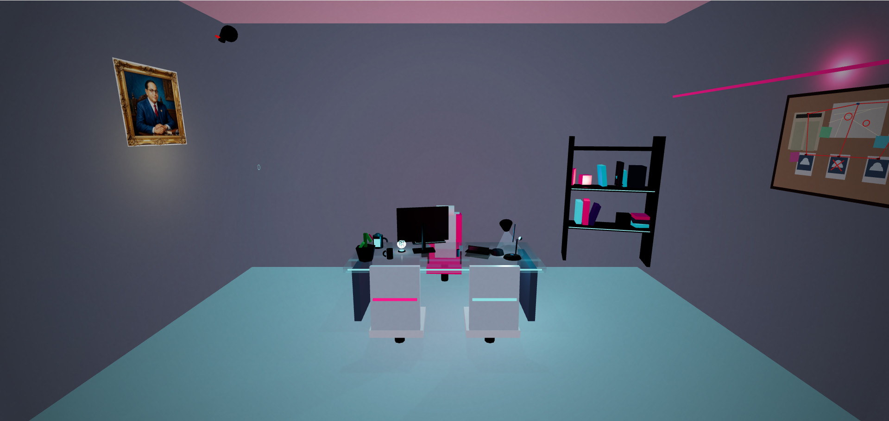

# 3D Detective Room



An interactive 3D detective office (or hacker's den) built using React, Three.js, React Three Fiber, and TailwindCSS. The scene features deep industrial concrete textures, glowing neon accents, and interactive procedural meshes.

## Features

- **Procedural 3D Environment**: High-fidelity room with industrial concrete grey walls, realistic shadows, and ambient point/spot lighting.
- **3D Aesthetic**:
  - Spinning cyan wireframe hologram projector on the desk.
  - Animated panning security camera mounted in the corner.
  - Crime investigation board with polaroids, neon push-pins, and connecting red strings.
  - Scattered neon energy drinks (cyan and crushed magenta).
  - A messy, lived-in bookshelf with glowing books.
  - A custom synthwave hover-chair.
- **Interactive Objects**: 
  - Lamp intensity toggle (illuminating the desk)
  - Coffee mug spin
  - Swivel chair drag/rotation
  - Watering can interaction
  - RGB mechanical keyboard lighting toggle

## Getting Started

### Prerequisites
- Node.js (v18 or higher recommended)

### Run Locally

1. Install dependencies:
   ```bash
   npm install
   ```

2. Start the development server:
   ```bash
   npm run dev
   ```

3. Build for production:
   ```bash
   npm run build
   ```
